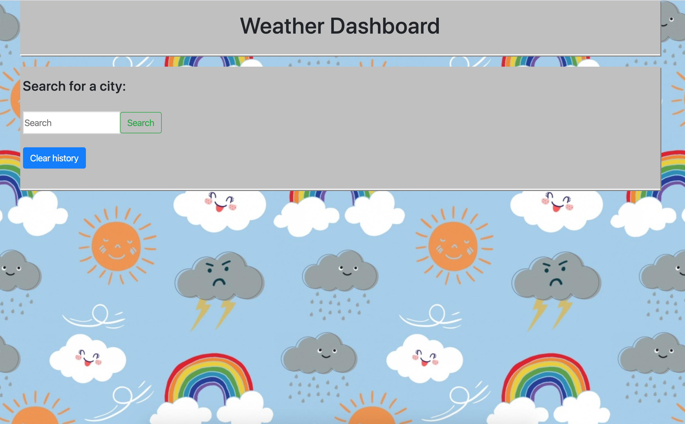

# Weather-Dashboard

## Project Title: Weather-Dashboard
## Project Description
This project describes how to build a weather dashboard application with search functionality to find current weather conditions and the future weather outlook for multiple cities.  This app will run in the browser and feature dynamically updated HTML and CSS powered by Jquery code.

```
As a traveler
I want to see the weather outlook for multiple cities
so that I can plan a trip accordingly
```

## Features of the application:
* The app displays the following under current weather conditions:
* A search field for user to input the name of the city to get the weather details
    * City
    * Date
    * Icon image (visual representation of weather conditions)
    * Temperature
    * Humidity
    * Wind speed
    * UV index
* Includes a search history so that users can access their past search terms. 
* Clicking on the city name will perform a new search that returns current and future conditions for that city.
* Includes a clear button to clear the search history
* Includes a 5-Day Forecast below the current weather conditions. Each day for the 5-Day Forecast will display the following:
    * Date
    * Icon image (visual representation of weather conditions)
    * Temperature
    * Humidity

## Installation
In order to install this project, follow the instructions below.
* Prerequisites
Laptop (Mac or Windows) with 8 GB RAM and 64-bit dual-core processor
* Install the following programs on your computer
Visual Studio Code
"Open in Browser" Visual Studio Code extension
Git Bash (Windows only)
Terminal (Mac only; preinstalled)
SSH keys

## Accessing the project files on VS Code
* Create a Github account so you can access the project repository, fork it to your account and then clone (make a copy of the repo) onto your local computer
* Using terminal cd into the directory where the repo is cloned and type command "code ." to open the project in VS code to view the project files
* There are three main files index.html, contact.html and portfolio.html and assets folder which contains css folder with style.css and reset.css files and an images folder with all the images used in the project
* The homepage of this project is called index.html which has the code for the landing page for the basic portfolio website, which contains the information about the developer.

## Screenshots of the application
* Here is a screenshot of the landing page of the weather-dashboard application

* Here is a screenshot of the application when you search for weather in a particular city 


